# 1. Data Exploration and Analysis

## 1.1 Dataset Overview

### 1.1.1 Dataset Description

This project uses the ISIC 2018 Skin Lesion Analysis dataset, a widely used benchmark for computer vision research in dermatology. The dataset was released as part of the International Skin Imaging Collaboration (ISIC) Challenge 2018, which aims to advance automated melanoma detection.

The dataset contains dermoscopic images collected from multiple clinical centers and imaging devices. Dermoscopy is a non-invasive imaging technique used by dermatologists to examine skin lesions with enhanced visualization of subsurface structures.

The challenge dataset is organized into three main tasks:

| Task | Description |
|------|-------------|
| Task 1 | Lesion segmentation |
| Task 2 | Dermoscopic attribute detection |
| Task 3 | Disease classification |

In this project, the focus is primarily on Task 2: Dermoscopic Attribute Detection, which involves identifying clinically meaningful structural patterns inside a skin lesion.

### 1.1.2 Dataset Composition

The dataset includes:

| Component | Description | Count |
|-----------|-------------|-------|
| Task 1-2 Training Input | High-resolution dermoscopic images (JPG) | 2,594 images |
| Task 1 Ground Truth | Binary lesion segmentation masks (PNG) | 2,594 masks |
| Task 2 Ground Truth v3 | Dermoscopic attribute annotation masks (PNG) | 12,970 masks (2,594 images × 5 attributes) |
| Task 3 Training Input | Classification images (600×450 JPG) | 10,015 images |

Each image may contain zero or more dermoscopic structures.

### 1.1.3 Dermoscopic Structures

Five dermoscopic attributes are annotated:

| Attribute | Clinical Meaning |
|-----------|-----------------|
| Pigment Network | A grid-like pigmentation pattern often associated with melanocytic lesions |
| Negative Network | Inverse pigment network pattern |
| Streaks | Radial streak-like structures around lesion borders |
| Milia-like Cysts | Small white/yellow keratin cysts |
| Globules | Round pigmented structures |

These structures are important visual cues used by dermatologists when diagnosing melanoma and other skin conditions.

### 1.1.4 Image Characteristics

The images present significant real-world variability:

| Source of Variability | Examples |
|----------------------|----------|
| Imaging devices | Different dermatoscope models |
| Lighting | Varying illumination conditions |
| Magnification | Different zoom levels |
| Skin tone | Diverse patient populations |
| Clinical artifacts | Hair occlusion, ruler markings, color calibration patches, circular dermatoscope borders |

This variability increases the difficulty of automated analysis but makes the dataset more representative of real clinical environments.

#### Image Resolution Statistics (Task 1-2, sampled 300 images)

| Metric | Width (px) | Height (px) | Aspect Ratio |
|--------|-----------|------------|-------------|
| Min | 576 | 542 | 0.75 |
| Mean | 2,947 | 2,005 | 1.43 |
| Median | 3,008 | 2,000 | 1.50 |
| Max | 6,708 | 4,461 | 1.52 |

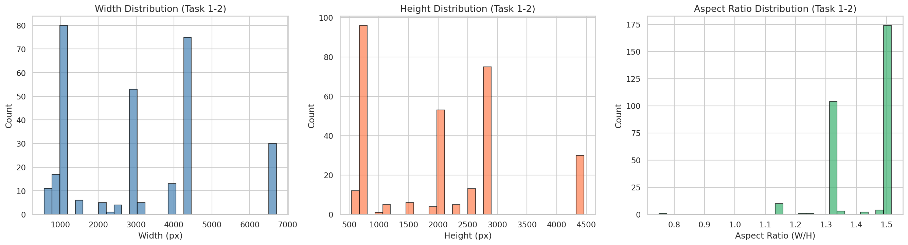
*Figure 1: Distribution of image widths, heights, and aspect ratios across Task 1-2 dermoscopic images.*

## 1.2 Exploratory Data Analysis

### 1.2.1 Image Resolution Distribution

Images in the ISIC dataset vary in resolution, typically ranging between ~540×720 and ~1024×1024. High resolution is beneficial for detecting small dermoscopic structures such as globules and cysts, but it also increases computational cost.

A histogram of image resolutions can reveal dataset heterogeneity and the potential need for resizing during training.

### 1.2.2 Attribute Frequency Distribution

Dermoscopic attributes are highly imbalanced. Based on a sample of 200 images from the 2,594 annotated images:

| Attribute | % Images with Positive Annotation | Mean Pixel Coverage |
|-----------|-----------------------------------|--------------------|
| Pigment Network | 59.0% | 3.74% |
| Milia-like Cyst | 28.5% | 0.23% |
| Globules | 25.0% | 0.53% |
| Negative Network | 6.5% | 0.19% |
| Streaks | 3.5% | 0.06% |

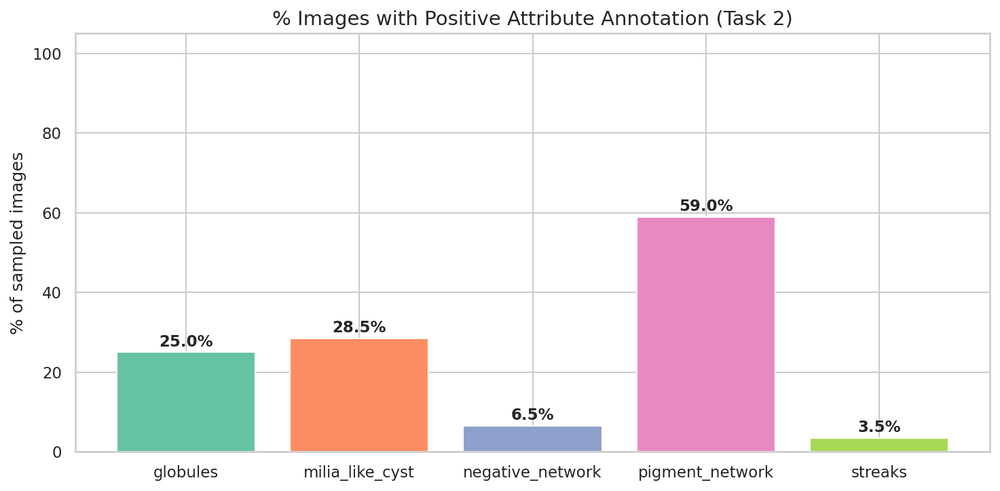
*Figure 2: Percentage of images containing positive annotations for each dermoscopic attribute.*

Pigment network is the most prevalent structure, appearing in 59% of images. In contrast, streaks (3.5%) and negative network (6.5%) are extremely rare, posing significant challenges for supervised learning.

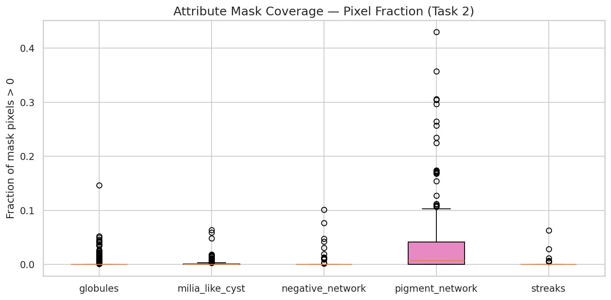
*Figure 3: Distribution of pixel coverage (fraction of positive pixels) for each attribute across sampled images.*

Even when present, most structures occupy a very small fraction of the image. Pigment network has the highest mean coverage at only 3.74%, while streaks average just 0.06%. This extreme pixel-level imbalance demands careful loss function design.

### 1.2.3 Spatial Characteristics of Structures

Dermoscopic attributes tend to be localized and small compared to the lesion area.

#### Lesion Size Statistics (Task 1, sampled 300 segmentation masks)

| Metric | Lesion Area (% of image) |
|--------|-------------------------|
| Mean | 21.7% |
| Median | 12.2% |
| Min | 0.4% |
| Max | 98.7% |

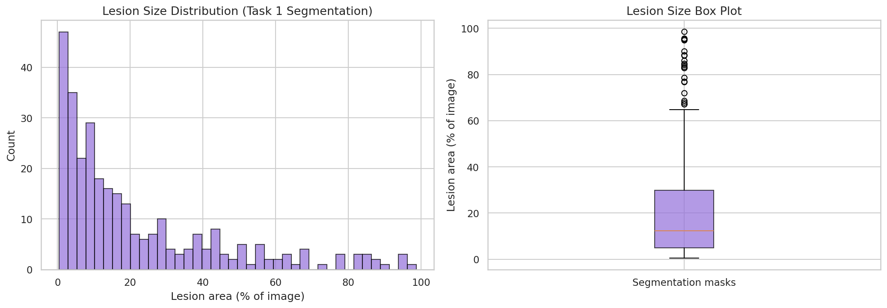
*Figure 4: Distribution of lesion area as a percentage of total image area (Task 1 segmentation masks). Most lesions are relatively small, with a right-skewed distribution.*

The distribution is right-skewed: most lesions are small (median 12.2%), while a long tail extends to very large lesions covering nearly the entire image.

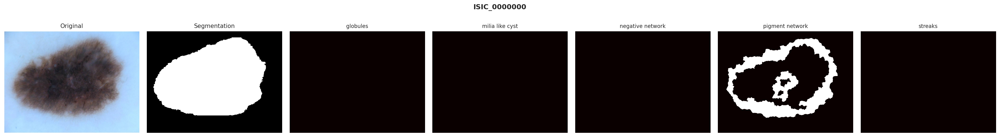
*Figure 5: Example dermoscopic image with its segmentation mask and all 5 attribute annotations.*

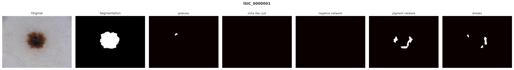
*Figure 6: Second example showing the original image, segmentation mask, and attribute masks. Note the sparse nature of attribute annotations.*

### 1.2.4 Co-occurrence of Attributes

Multiple dermoscopic structures may appear within a single lesion. Analysis of 300 sampled images reveals:

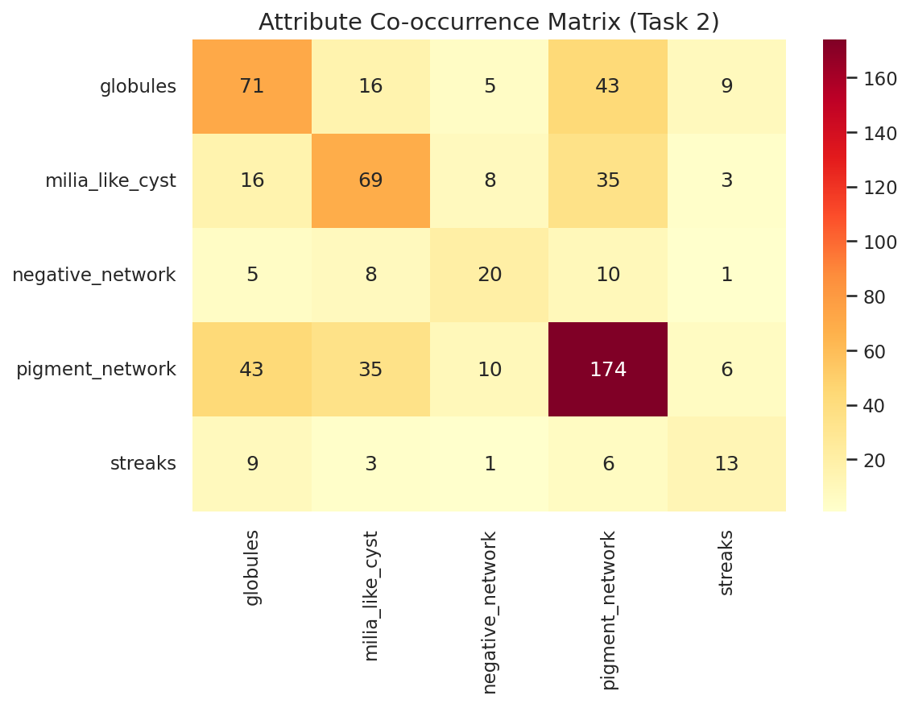
*Figure 7: Co-occurrence matrix showing how frequently pairs of dermoscopic attributes appear together in the same image.*

Key patterns:

| Pattern | Observation |
|---------|-------------|
| Pigment network + globules | Co-occur most frequently (43 images), as both are common features of melanocytic lesions |
| Streaks | Rarely co-occurs with other attributes, reflecting its rarity |
| Negative network | Rarely co-occurs with other attributes, reflecting its rarity |
| Diagonal values | Confirm the individual attribute prevalences |

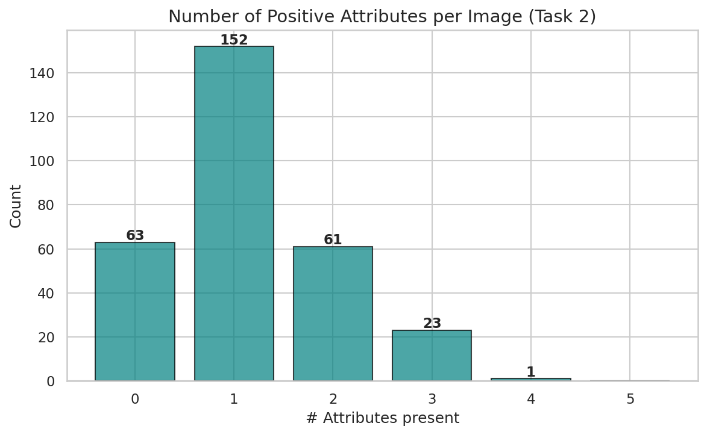
*Figure 8: Distribution of the number of positive dermoscopic attributes per image.*

| # Attributes | Count | Percentage |
|-------------|-------|------------|
| 0 (unlabeled) | 63 | 21.0% |
| 1 | 152 | 50.7% |
| 2 | 61 | 20.3% |
| 3 | 23 | 7.7% |
| 4 | 1 | 0.3% |

21.0% of images have no positive attribute annotations, effectively making them "unlabeled" for structure detection. 50.7% have exactly one attribute, and only 8% have 3 or more. Mean attributes per image: 1.16.

## 1.3 Annotation Quality Analysis

While the ISIC dataset provides valuable annotations, several limitations affect annotation quality.

### 1.3.1 Sparse Annotations

Many dermoscopic attributes occur infrequently. Quantitatively:

| Issue | Detail |
|-------|--------|
| Streaks prevalence | Only 3.5% of images (mean pixel coverage: 0.06%) |
| Negative network prevalence | Only 6.5% of images (mean pixel coverage: 0.19%) |
| Unlabeled images | 21% of images have zero positive attribute annotations |

This extreme sparsity results in:

| Consequence | Description |
|-------------|-------------|
| Image-level imbalance | Extremely skewed class distribution across attributes |
| Pixel-level imbalance | Very small positive pixel regions relative to image size |
| Representation difficulty | Hard to learn reliable features for rare structures |

### 1.3.2 Boundary Uncertainty

Dermoscopic structures often have ambiguous boundaries. For example: pigment networks gradually fade into surrounding skin, globules may have unclear borders, and streaks may appear fragmented.

As a result, different annotators may draw slightly different masks, and pixel-level annotations may contain inconsistencies. This leads to inter-annotator variability.

### 1.3.3 Missing or Incomplete Annotations

Another common issue is annotation incompleteness. In some images, structures may be present but not fully annotated.

Possible causes include:

| Cause | Description |
|-------|-------------|
| Annotation fatigue | Annotators may miss structures in later images |
| Limited expert time | Not enough time to annotate all visible structures |
| Subtle structures | Difficulty identifying faint or ambiguous patterns |

This introduces false negatives in the ground truth masks.

### 1.3.4 Annotation Granularity

Certain structures may be annotated differently depending on the annotator's interpretation. For example, a cluster of globules might be labeled as separate objects or a single region, and weak pigment networks may be partially labeled. This variability increases training noise.

## 1.4 Impact of Annotation Quality on AI Models

Annotation quality has a significant impact on model training and evaluation.

### 1.4.1 Training Instability

Noisy labels can cause unstable gradients, inconsistent training signals, and slower convergence.

### 1.4.2 Penalizing Correct Predictions

If a structure exists but is not annotated, the model may correctly detect it but still be penalized during training. This can lead to under-confident predictions and suppressed detection of subtle structures.

### 1.4.3 Difficulty Learning Rare Structures

For rare attributes, models may overfit to a small number of examples, and segmentation performance may vary significantly across training runs.

### 1.4.4 Reduced Evaluation Reliability

If annotations are incomplete, evaluation metrics such as Dice score and Intersection-over-Union may underestimate model performance.

## 1.5 Key Insights from Dataset Exploration

From the exploratory analysis, several important observations emerge:

| # | Insight | Detail |
|---|---------|--------|
| 1 | Severe class imbalance | Pigment network appears in 59.0% of images while streaks appear in only 3.5% (a 16.9× imbalance ratio) |
| 2 | Small structure size | Mean pixel coverage ranges from 0.06% (streaks) to 3.74% (pigment network), making segmentation extremely challenging |
| 3 | Unlabeled images | 21% of images have no positive attribute annotations, introducing false-negative signal during training |
| 4 | High image variability | Resolutions range from 576×542 to 6,708×4,461, requiring standardized preprocessing |
| 5 | Wide lesion size variation | From 0.4% to 98.7% of image area (median 12.2%), requiring models robust to scale variation |

These insights motivate the design of an AI system that:

| Requirement | Approach |
|-------------|----------|
| Handle class imbalance | Focal loss, oversampling, class weights |
| Tolerate annotation noise | Label smoothing, noise-robust loss functions |
| Capture fine-grained structures | High-resolution input, multi-scale features |
| Generalize across conditions | Data augmentation, standardized preprocessing |

# 2. Problem Formulation and AI Design

## 2.1 Task Formulation

### 2.1.1 Overall Approach

This project formulates the problem as a multi-stage pipeline combining detection and segmentation:

| Stage | Task | Model | Output |
|-------|------|-------|--------|
| Stage 1 | Lesion detection | YOLOv8 | Bounding box around the lesion |
| Stage 2 | Lesion segmentation | MedSAM | Binary lesion boundary mask |
| Stage 3 | Attribute segmentation | MedSAM encoder + custom decoder | 5-channel dermoscopic attribute masks |

This hybrid approach is chosen over a single end-to-end model because:

| Reason | Explanation |
|--------|-------------|
| Task decomposition | Each stage solves a well-defined subtask, improving modularity |
| Scale handling | YOLOv8 localizes the lesion first, allowing downstream models to focus on the relevant region |
| Foundation model leverage | MedSAM provides strong pretrained representations, reducing the need for large labeled datasets |
| Clinical alignment | The pipeline mirrors dermatological workflow: locate lesion → delineate boundary → identify structures |

### 2.1.2 Stage 1: Lesion Detection (YOLOv8)

The first stage detects the lesion bounding box within the dermoscopic image.

| Aspect | Detail |
|--------|--------|
| Model | YOLOv8n-seg (nano segmentation variant) |
| Architecture | CSPDarknet backbone + PAN-FPN neck + Detection head |
| Input | Full dermoscopic image (resized to 640×640) |
| Output | Bounding box coordinates [x_center, y_center, width, height] |
| Classes | Single class: lesion |

YOLOv8 is selected for its fast inference speed and strong localization performance, which enables real-time clinical deployment.

### 2.1.3 Stage 2: Lesion Segmentation (MedSAM)

MedSAM performs precise lesion boundary segmentation using the bounding box from Stage 1 as a prompt.

| Component | Detail |
|-----------|--------|
| Image encoder | Vision Transformer (ViT-B), fine-tuned |
| Prompt encoder | Bounding box prompt, frozen during training |
| Mask decoder | Lightweight transformer decoder, fine-tuned |
| Input | 1024×1024 padded image + bounding box prompt |
| Output | Binary lesion segmentation mask |

#### Training Strategy

| Parameter | Value |
|-----------|-------|
| Trainable components | Image encoder + Mask decoder |
| Frozen components | Prompt encoder |
| Optimizer | AdamW (lr=1e-4, weight_decay=0.01) |
| Loss function | BCE + Dice loss |
| Scheduler | Cosine annealing |
| Epochs (this run) | 7 |
| Batch size (this run) | 2 |
| DataLoader workers (this run) | 2 |

### 2.1.4 Stage 3: Dermoscopic Attribute Segmentation

The attribute segmentation model identifies five dermoscopic structures within the cropped lesion region.

| Component | Detail |
|-----------|--------|
| Encoder | SAM ViT-B image encoder (frozen) |
| Decoder | Custom 4-stage upsampling decoder with ConvTranspose2d + ConvBlock |
| Input | Lesion crop resized to 1024×1024 |
| Output | 5-channel mask tensor [5, H, W] |

Each output channel corresponds to one dermoscopic attribute:

| Channel | Attribute |
|---------|-----------|
| 0 | Globules |
| 1 | Milia-like cyst |
| 2 | Negative network |
| 3 | Pigment network |
| 4 | Streaks |

## 2.2 Model Architecture

### 2.2.1 Why MedSAM

MedSAM (Medical Segment Anything Model) is chosen as the backbone for stages 2 and 3 for several reasons:

| Advantage | Explanation |
|-----------|-------------|
| Foundation model pretraining | SAM was trained on 11M images with 1B masks, providing strong visual representations |
| Medical adaptation | MedSAM fine-tunes SAM specifically for medical imaging tasks |
| Prompt-based segmentation | Bounding box prompts naturally integrate with the YOLOv8 detection output |
| Data efficiency | Fine-tuning requires significantly less labeled data than training from scratch |
| Generalization | Large-scale pretraining improves robustness to imaging variability |

### 2.2.2 Custom Attribute Decoder

The attribute decoder is a lightweight upsampling network that converts SAM encoder features (64×64×256) into full-resolution multi-label masks:

| Layer | Operation | Output Size |
|-------|-----------|-------------|
| Up1 | ConvTranspose2d(256→128, k=2, s=2) + ConvBlock | 128×128×128 |
| Up2 | ConvTranspose2d(128→64, k=2, s=2) + ConvBlock | 256×256×64 |
| Up3 | ConvTranspose2d(64→32, k=2, s=2) + ConvBlock | 512×512×32 |
| Up4 | ConvTranspose2d(32→16, k=2, s=2) + ConvBlock | 1024×1024×16 |
| Head | Conv2d(16→5, k=1) | 1024×1024×5 |

Each ConvBlock consists of two 3×3 convolutions with BatchNorm and ReLU activation.

## 2.3 Handling Dataset Challenges

### 2.3.1 Class Imbalance

The severe class imbalance (59% pigment network vs 3.5% streaks) is addressed through:

| Strategy | Implementation |
|----------|----------------|
| Weighted focal loss | Class weights inversely proportional to frequency, with focal modulation (γ=2.0) |
| Dice loss component | Explicit region-overlap optimization that is less sensitive to class imbalance |
| Combined loss | L_total = Focal_BCE + Dice_loss |

The class weights are computed as:

| Attribute | Frequency | Inverse Weight (normalized) |
|-----------|-----------|----------------------------|
| Globules | 25.0% | 0.79 |
| Milia-like cyst | 28.5% | 0.70 |
| Negative network | 6.5% | 2.66 |
| Pigment network | 59.0% | 0.34 |
| Streaks | 3.5% | 4.72 |

### 2.3.2 Small Structures

Dermoscopic structures occupy very small pixel regions (0.06%–3.74% mean coverage). The pipeline addresses this through:

| Strategy | Detail |
|----------|--------|
| Lesion cropping | Stage 3 crops to the lesion bounding box, increasing effective resolution of structures |
| High-resolution encoder input | Images are upsampled to 1024×1024 for SAM encoder |
| Dice loss | Directly optimizes region overlap, preventing the model from trivially predicting all-background |

### 2.3.3 Noisy and Missing Annotations

Approximately 21% of images have no positive attribute annotations.

| Strategy | Detail |
|----------|--------|
| Bounding box perturbation | Random noise added to bbox prompts during MedSAM training prevents overfitting to ground truth alignment |
| Data augmentation | Geometric and photometric augmentations simulate real-world variation |
| Foundation model initialization | SAM's pretrained representations reduce overfitting to the small, noisy training set |

## 2.4 Preprocessing Pipeline

### 2.4.1 Image Normalization

| Step | Detail |
|------|--------|
| Resize | Longest side scaled to 1024px, preserving aspect ratio |
| Padding | Zero-padded to 1024×1024 square |
| Intensity | Pixel values normalized to [0, 1] via division by 255 |

### 2.4.2 Data Augmentation

| Category | Augmentations |
|----------|---------------|
| Geometric | Horizontal flip, vertical flip |
| Photometric | Random brightness (α∈[0.8, 1.2]), contrast shift (β∈[-0.1, 0.1]) |
| Prompt | Random bounding box perturbation (±20px) for MedSAM training |

### 2.4.3 Dataset Split

| Split | Ratio | Count |
|-------|-------|-------|
| Training | 80% | 2,075 images |
| Validation | 20% | 519 images |

The split is performed at the image level with a fixed random seed (42) for reproducibility.

# 3. Clinical Visualization and User Experience

## 3.1 Information for Dermatologists

### 3.1.1 What to Show

The AI system should present the following outputs to support clinical decision-making:

| Output | Purpose |
|--------|---------|
| Lesion boundary overlay | Clearly delineates the lesion border on the original dermoscopic image |
| Attribute heatmaps | Color-coded overlays showing detected dermoscopic structures |
| Confidence maps | Per-pixel probability values indicating model certainty |
| Quantitative summary | Percentage of lesion area occupied by each detected structure |

### 3.1.2 Lesion Boundary Visualization

The lesion segmentation mask from Stage 2 should be displayed as a semi-transparent overlay on the original image:

| Element | Specification |
|---------|---------------|
| Overlay color | Green contour line (2-3px) |
| Transparency | 30-40% fill opacity |
| Interaction | Toggle visibility on/off |
| Additional info | Lesion area in mm² (if calibration available), lesion diameter |

### 3.1.3 Dermoscopic Structure Maps

Each detected attribute should be displayed using a distinct color scheme:

| Attribute | Suggested Color | Clinical Significance |
|-----------|----------------|----------------------|
| Pigment network | Blue overlay | Regular patterns suggest benign; irregular patterns suggest malignancy |
| Negative network | Red overlay | Associated with melanoma and Spitz nevi |
| Streaks | Orange overlay | Radial streaming may indicate melanoma |
| Milia-like cysts | Yellow overlay | Typically associated with seborrheic keratosis |
| Globules | Purple overlay | Regular globules suggest benign; irregular suggest malignancy |

### 3.1.4 Confidence Maps

Rather than showing only binary predictions, the system should provide continuous confidence maps:

| Feature | Detail |
|---------|--------|
| Display | Heatmap overlay with color scale (low→high confidence) |
| Threshold indicator | Clear marking of the decision threshold (0.5) |
| Uncertainty regions | Highlight areas where the model is uncertain (prediction ≈ 0.5) |

## 3.2 Supporting Clinical Decisions

### 3.2.1 How AI Outputs Support Diagnosis

| Support Type | Description |
|-------------|-------------|
| Pattern highlight | Automatically identifies structures that may be difficult to spot in complex images |
| Quantitative metrics | Provides objective measurements of structure proportion and distribution |
| Consistency | Reduces inter-observer variability by providing standardized structure detection |
| Screening acceleration | Enables faster review of dermoscopic images in clinical workflow |

### 3.2.2 Complementing Classification Results

The attribute segmentation output complements existing melanoma classification systems:

| Integration | Benefit |
|-------------|---------|
| Explainability | Shows which dermoscopic structures contributed to a classification decision |
| Second opinion | Highlights structures that may change a clinical assessment |
| Training tool | Helps residents learn to identify dermoscopic patterns |

## 3.3 What Not to Show

### 3.3.1 Outputs to Avoid

| Output to Avoid | Reason |
|-----------------|--------|
| Definitive diagnosis | The system detects structures, not diseases; diagnosis is the clinician's responsibility |
| Raw model scores without context | Uninformed numeric outputs can be misinterpreted |
| Predictions on low-quality images | Blurry, poorly lit, or heavily occluded images should trigger a quality warning |
| Single-attribute focus | Showing only one structure without context may lead to confirmation bias |

### 3.3.2 Risk Mitigation

| Risk | Mitigation |
|------|------------|
| Over-reliance | Clear disclaimer that AI is a decision-support tool, not a diagnostic tool |
| False confidence | Display model uncertainty alongside predictions |
| Automation bias | Encourage clinicians to verify AI outputs against their own assessment |

# 4. Experiments and Results

The full training notebook for this experiment is available at:
**[https://www.kaggle.com/code/phamtiensondeptrai1/isic-2018?scriptVersionId=303619943](https://www.kaggle.com/code/phamtiensondeptrai1/isic-2018?scriptVersionId=303619943)**

## 4.1 Experimental Setup

### 4.1.1 Model Configuration

The three-stage pipeline is trained sequentially:

| Stage | Model | Training Data | Hardware |
|-------|-------|---------------|----------|
| Stage 1 | YOLOv8n | 2,075 train / 519 val images | Kaggle GPU (T4) |
| Stage 2 | MedSAM (ViT-B) | 2,075 train / 519 val npz files | Kaggle GPU (T4) |
| Stage 3 | SAM encoder + Attribute decoder | 2,075 train / 519 val npz files | Kaggle GPU (T4) |

### 4.1.2 Training Configuration

#### Stage 1: YOLOv8 Lesion Detection

| Parameter | Value |
|-----------|-------|
| Base model | yolov8n.pt (pretrained on COCO) |
| Image size | 640×640 |
| Epochs | 60 |
| Batch size | 32 |
| Workers | 2 |
| Patience | 15 (early stopping) |
| Optimizer | SGD (YOLOv8 default) |

#### Stage 2: MedSAM Lesion Segmentation

| Parameter | Value |
|-----------|-------|
| Base model | sam_vit_b_01ec64.pth (SAM ViT-B pretrained) |
| Image size | 1024×1024 |
| Epochs | 7 |
| Batch size | 2 |
| Workers | 2 |
| Optimizer | AdamW (lr=1e-4, wd=0.01) |
| Loss | BCE + Dice |
| Scheduler | Cosine annealing |
| Bbox perturbation | ±20px random shift |

#### Stage 3: Attribute Segmentation

| Parameter | Value |
|-----------|-------|
| Encoder | SAM ViT-B (frozen) |
| Decoder | 4-stage ConvTranspose decoder |
| Crop size | 256×256 (lesion region) |
| Encoder input | 1024×1024 (upsampled) |
| Epochs | 20 |
| Batch size | 2 |
| Workers | 2 |
| Optimizer | AdamW (lr=1e-4, wd=0.01) |
| Loss | Weighted focal BCE (γ=2.0) + Dice |
| Scheduler | Cosine annealing |

### 4.1.3 Loss Functions

#### BCE + Dice Loss (Stage 2)

$$L_{total} = L_{BCE} + L_{Dice}$$

Where:

$$L_{BCE} = -\frac{1}{N}\sum_{i}[y_i \log(p_i) + (1-y_i)\log(1-p_i)]$$

$$L_{Dice} = 1 - \frac{2|P \cap G| + \epsilon}{|P| + |G| + \epsilon}$$

#### Weighted Focal Dice Loss (Stage 3)

$$L_{focal} = -\alpha_c(1-p_t)^\gamma \log(p_t)$$

$$L_{total} = L_{focal} + L_{Dice}$$

Where $\gamma = 2.0$ and $\alpha_c$ is the class-specific weight inversely proportional to attribute frequency.

### 4.1.4 Evaluation Metrics

| Metric | Formula | Use |
|--------|---------|-----|
| Dice coefficient | $\frac{2TP}{2TP + FP + FN}$ | Primary segmentation metric |
| IoU (Jaccard) | $\frac{TP}{TP + FP + FN}$ | Region overlap metric |
| mAP50 / mAP50-95 | Standard COCO detection metrics | YOLOv8 lesion detection |

## 4.2 Quantitative Results

### 4.2.1 Stage 1: YOLOv8 Lesion Detection

```python
model = train_yolo_module.train(epochs=60, batch=32, img_size=640, workers=2)
```

Validation metrics are reported by `validate_yolo_module.validate()` after training completes.

### 4.2.2 Stage 2: MedSAM Lesion Segmentation

```python
train_medsam_module.train(epochs=7, batch=2, lr=1e-4, workers=2)
```

Final training log:

```
Epoch   7/7 | train_loss: 0.1608 | val_loss: 0.1847 | val_dice: 0.9490 | val_iou: 0.9061 | lr: 0.00e+00 | 1719.3s
  → saved best model (dice=0.9490)
Training complete. Best val dice: 0.9490
```

| Metric | Value |
|--------|-------|
| Train loss (epoch 7) | 0.1608 |
| Val loss (epoch 7) | 0.1847 |
| Val Dice | 0.9490 |
| Val IoU | 0.9061 |
| Best val Dice | **0.9490** |

### 4.2.3 Stage 3: Attribute Segmentation

```python
train_attr_module.train(epochs=20, batch=2, lr=1e-4, workers=2)
```

Final training log:

```
Epoch  20/20 | train_loss: 0.9143 | val_loss: 0.9429 | mean_dice: 0.5038 | mean_iou: 0.4849 | lr: 0.00e+00 | 1116.9s
    globules                 : dice=0.1687  iou=0.1458
    milia_like_cyst          : dice=0.1670  iou=0.1612
    negative_network         : dice=0.9326  iou=0.9326
    pigment_network          : dice=0.3087  iou=0.2429
    streaks                  : dice=0.9420  iou=0.9420
Training complete. Best mean dice: 0.7320
```

Summary:

| Metric | Value |
|--------|-------|
| Train loss (epoch 20) | 0.9143 |
| Val loss (epoch 20) | 0.9429 |
| Mean Dice (epoch 20) | 0.5038 |
| Mean IoU (epoch 20) | 0.4849 |
| Best mean Dice (over all epochs) | **0.7320** |

Per-attribute results at epoch 20:

| Attribute | Frequency in data | Dice | IoU |
|-----------|-------------------|------|-----|
| Negative network | 6.5% | **0.9326** | 0.9326 |
| Streaks | 3.5% | **0.9420** | 0.9420 |
| Pigment network | 59.0% | 0.3087 | 0.2429 |
| Globules | 25.0% | 0.1687 | 0.1458 |
| Milia-like cyst | 28.5% | 0.1670 | 0.1612 |

## 4.3 Qualitative Visualizations

### 4.3.1 Stage 1: YOLOv8 Lesion Detection

The figure below compares the ground truth bounding box (green) with the model's predicted bounding box (red) on a validation sample.

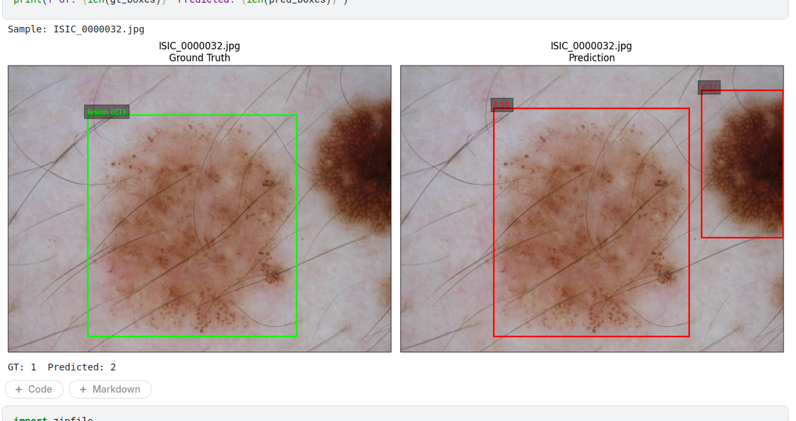
*Figure 9: YOLOv8 lesion detection on a validation image. Green: ground truth box. Red: predicted box with confidence score.*

### 4.3.2 Stage 2: MedSAM Lesion Segmentation

The figure below shows the ground truth lesion mask (green overlay) alongside the MedSAM predicted mask (red overlay), with the bounding box prompt visible on both panels.

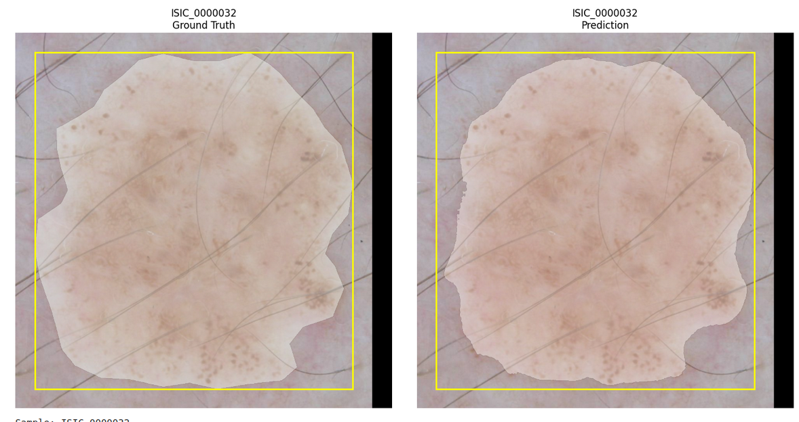
*Figure 10: MedSAM lesion segmentation on a validation sample. Left: ground truth mask. Right: predicted mask. Yellow box: bounding box prompt from Stage 1.*

### 4.3.3 Stage 3: Attribute Segmentation

The figures below show per-attribute predictions across two validation samples. Each row corresponds to one dermoscopic attribute, with the ground truth (green) on the left and the prediction (red) on the right.

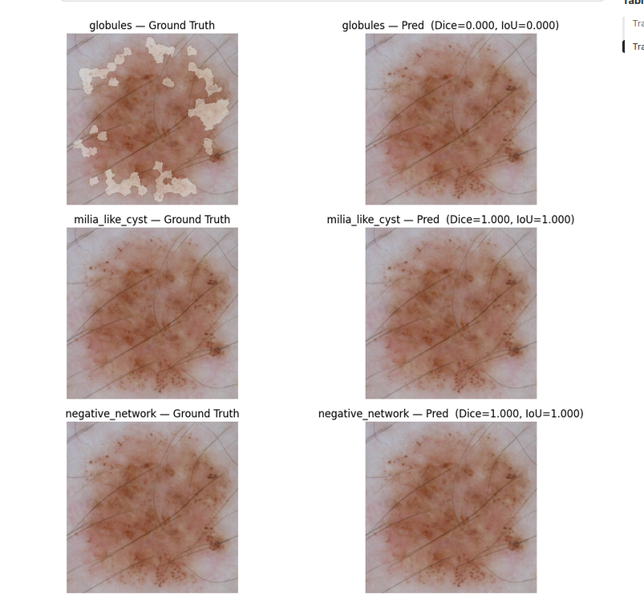
*Figure 11: Attribute segmentation predictions for validation sample 1. Rows from top: globules, milia-like cyst, negative network, pigment network, streaks.*

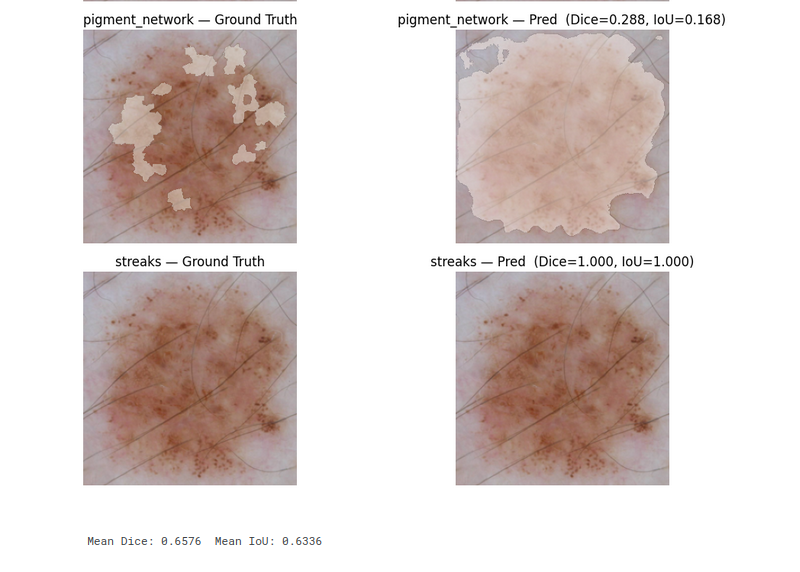
*Figure 12: Attribute segmentation predictions for validation sample 2.*

## 4.4 Discussion of Limitations and Failure Cases

### 4.4.1 Hardware Constraints and Undertrained Models

Training was conducted on Kaggle free-tier GPU (T4), which severely limited the number of epochs that could be run within the session time budget. Each epoch for MedSAM required approximately **1 hour** of compute time, which is why Stage 2 was limited to 7 epochs and Stage 3 to 20 epochs. The default configuration in the source code calls for 50 and 80 epochs respectively. Models are almost certainly undertrained, and all reported metrics should be interpreted as lower bounds on what a fully trained pipeline could achieve.

### 4.4.2 Inaccurate Ground Truth Annotations

As visible in Figure 9, the YOLOv8 model detects **two distinct lesions** in the image while the ground truth bounding box covers only one. This is not necessarily a model error — the annotation may be incomplete or inconsistent. The ISIC 2018 dataset was annotated by multiple experts across different clinical centers, and some images contain more than one lesion or ambiguous boundaries that were partially or inconsistently labeled.

This creates a fundamental problem: the model is penalized during training and evaluation for predictions that are visually reasonable but not present in the ground truth. Metrics such as Dice and IoU underestimate true model performance in such cases.

### 4.4.3 Lack of Confidence Estimation in MedSAM

The current implementation outputs a binary mask by applying a fixed threshold of 0.5 to the sigmoid of the predicted logits. This discards potentially useful uncertainty information. A more robust approach would be to compute a **per-pixel confidence score** from the raw mask logits:

$$\text{confidence}(x) = \left| \text{logit}(x) \right| = \left| \sigma^{-1}(p(x)) \right|$$

Pixels with logits close to zero are uncertain, while pixels with high absolute logit values are confidently positive or negative. Exposing this as a continuous heatmap to the clinician — rather than a hard binary mask — would better communicate model uncertainty and reduce automation bias.

### 4.4.4 Inflated Dice Score on Empty Ground Truth Masks

The Dice coefficient has a well-known degenerate case: when the ground truth mask is entirely empty (all-zero) and the model also predicts all-zero, the Dice score is 1.0 by the smoothed formula:

$$\text{Dice} = \frac{2 \cdot 0 + \epsilon}{0 + 0 + \epsilon} = 1.0$$

In the ISIC 2018 dataset, approximately **21% of images have no positive attribute annotations** for any of the five structures. When training the attribute segmentation model, these empty masks artificially inflate the reported Dice score, particularly for rare attributes such as streaks (3.5% prevalence) and negative network (6.5% prevalence). This partially explains the unexpectedly high Dice for negative network (0.9326) and streaks (0.9420) at epoch 20 — the model may have learned to predict empty masks for most inputs, which is trivially "correct" when the ground truth is also empty.

Two possible mitigations are:

1. **Filter empty masks from evaluation**: Compute Dice and IoU only on samples where the ground truth contains at least one positive pixel, giving a more honest estimate of segmentation quality on actual attribute regions.
2. **Two-stage attribute detection**: Train a separate image-level classifier to predict which attributes are present, then run the segmentation model only on those attributes. This avoids forcing the segmentation decoder to learn a trivial all-zero output for absent attributes, and also reduces multi-level imbalance.

### 4.4.5 Multi-Level Class Imbalance

The dataset suffers from imbalance at three distinct levels simultaneously, which makes it especially difficult to address with any single technique:

| Level | Description | Example |
|-------|-------------|---------|
| Image-level | Many images have no attribute annotations | ~21% of images are entirely unlabeled for attributes |
| Class-level | Attributes vary greatly in prevalence | Pigment network: 59%, Streaks: 3.5% — a 17× ratio |
| Pixel-level | Even present attributes cover very little area | Range: 0.06% (streaks) to 3.74% (pigment network) of pixels |

The current approach applies weighted focal loss with class-frequency-based weights, which partially addresses class-level imbalance. However, focal loss alone is insufficient because it operates at the pixel level and does not account for image-level or class-level imbalance holistically.

Additionally, the effectiveness of standard data augmentation techniques in this domain is uncertain. Geometric transforms such as horizontal flip and 90° rotation are commonly applied in natural image tasks, but in dermoscopy:

- **Rotation** may be acceptable because lesion morphology is largely rotation-invariant.
- **Flipping** is generally safe but does not introduce new biological variability.
- **Colour jitter** is risky: dermoscopic features like pigment network colour and milia-like cyst brightness are clinically meaningful. Altering colour values may corrupt the visual cues the model needs to learn.
- **Skin tone variation** is a separate concern — different skin tones can affect how attributes appear visually, and augmenting with synthetic tone shifts may introduce unrealistic patterns rather than clinically valid ones.

Without dermatological domain expertise, it is difficult to guarantee that common augmentations produce images that represent plausible clinical variation rather than introducing artefacts that mislead the model.

# 5. Critical Thinking and Future Work

## 5.1 Improvements with More Data

### 5.1.1 Leveraging Unlabeled Data

| Approach | Description |
|----------|-------------|
| Semi-supervised learning | Use pseudo-labels from confident model predictions on unlabeled dermoscopic images |
| Self-supervised pretraining | Pretrain the encoder on unlabeled dermoscopic images using contrastive learning (e.g., SimCLR, DINO) |
| Active learning | Prioritize annotation of images where the model is most uncertain, maximising label efficiency |

### 5.1.2 Weak Labels and Clinician Feedback

| Approach | Description |
|----------|-------------|
| Image-level labels | Use Task 3 classification labels as weak supervision to indicate attribute presence before training segmentation |
| Point-click annotation | Allow clinicians to provide quick point annotations instead of full pixel masks |
| Interactive refinement | Use SAM's prompt-based interface for clinician-guided correction of predicted masks |
| Feedback loop | Continuously improve the model by incorporating corrected predictions as new training examples |

## 5.2 Clinical Validation

### 5.2.1 Beyond Technical Metrics

Dice and IoU measure agreement with a fixed ground truth, but that ground truth is itself imperfect (see Section 4.4.2). True clinical validation requires a different approach:

| Validation Aspect | Method |
|--------------------|--------|
| Inter-rater agreement | Compare AI predictions against multiple expert annotations using Fleiss' kappa |
| Clinical utility study | Measure whether AI-assisted diagnosis improves sensitivity/specificity versus unaided clinician |
| Time-motion study | Assess whether the tool reduces time-to-diagnosis in a controlled clinical workflow |
| Prospective evaluation | Test on prospectively collected data from new clinical sites not seen during training |

### 5.2.2 Regulatory Considerations

| Consideration | Detail |
|---------------|--------|
| Intended use | Decision-support tool, not an autonomous diagnostic device |
| Performance benchmarks | Must meet or exceed minimum Dice/IoU thresholds established by clinical consensus |
| Bias assessment | Evaluate performance stratified by skin tone, imaging device, and clinical site |
| Failure mode documentation | Known limitations and edge cases must be documented and communicated to users |

## 5.3 Deployment Risks

### 5.3.1 Technical Risks

| Risk | Description | Mitigation |
|------|-------------|------------|
| Hardware constraints | MedSAM ViT-B is large; inference is slow on CPU | Model distillation or quantization for edge deployment |
| Domain shift | Images from new devices or populations may degrade performance | Continuous monitoring; periodic retraining on new data |
| Model degradation | Clinical imaging practices evolve over time | Scheduled retraining and version-controlled model registry |

### 5.3.2 Clinical Risks

| Risk | Description | Mitigation |
|------|-------------|------------|
| Automation bias | Clinicians may over-trust AI outputs without critical review | Display confidence scores alongside predictions; require explicit clinician acknowledgement |
| False negatives | Missed structures could contribute to diagnostic errors | Present uncertainty maps; flag low-confidence predictions prominently |
| Equity concerns | Performance may vary across skin tones if training data is not representative | Stratified evaluation; targeted data collection for underrepresented groups |
| Liability | Unclear responsibility if AI-assisted diagnosis leads to patient harm | Clear documentation that the tool provides decision support only, not diagnosis |

## 5.4 Future Directions

| Direction | Description |
|-----------|-------------|
| Two-stage attribute pipeline | Add an attribute presence classifier before the segmentation model to avoid training on empty masks |
| Confidence estimation | Replace hard binary masks with continuous logit-based confidence heatmaps for clinical display |
| Multi-task learning | Jointly train lesion segmentation and attribute detection in a unified architecture |
| Longer training with better hardware | Access to A100/H100 class hardware would allow full training with 50+ epochs per stage |
| Vision-language models | Integrate textual clinical descriptions with visual features for improved interpretability |
| Federated learning | Train across multiple institutions without sharing patient data to improve generalization |
| Knowledge distillation | Compress MedSAM into a smaller model for deployment on clinical workstations or mobile devices |
